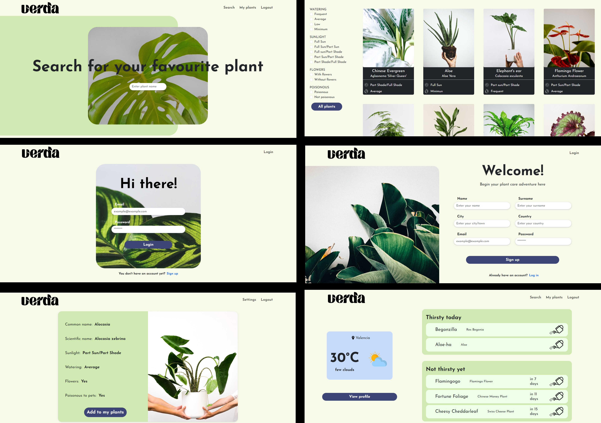
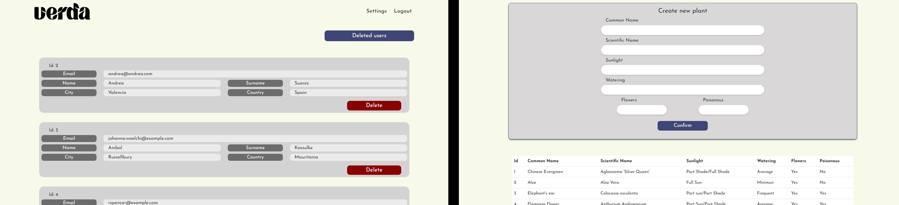

*First in Spanish then in* [*English*](https://github.com/ansualo/frontend-proyectofinal#final-project---verda---frontend)

# PROYECTO FINAL - VERDA - FRONTEND 

<details>
  <summary>Contenido 📝</summary>
  <ol>
    <li><a href="#objetivo">Objetivo</a></li>
    <li><a href="#sobre-el-proyecto">Sobre el proyecto</a></li>
    <li><a href="#como-funciona">Como funciona</a></li>
    <li><a href="#stack">Stack</a></li>
    <li><a href="#instalación-en-local">Instalación</a></li>
    <li><a href="#vistas">Vistas</a></li>
    <li><a href="#licencia">Licencia</a></li>
    <li><a href="#contacto">Contacto</a></li>
  </ol>
</details>

## Objetivo

En el siguiente proyecto se ha llevado a cabo la creación del frontend para el proyecto final del bootcamp Full Stack Developer en GeeksHubs Academy. El proyecto completo debía realizarse en una duración de dos semanas y, en esta parte, podemos ver el diseño y construcción de las vistas utilizando React. Además, se realizó la conexión con la API que previamente creamos como parte del proyecto backend.


## Sobre el proyecto 
El proyecto consiste en una página web diseñada para los amantes de las plantas de interior. Los usuarios podrán buscar información detallada sobre diversas especies y, además, tendrán la opción de añadir las plantas que poseen a su perfil, lo que les permitirá llevar un control preciso de su riego y cuidado.   

## Como funciona
Una vez registrados como usuarios, accederemos a nuestra área personal. En este apartado podremos ver nuestras plantas. Sin embargo, al no tener ninguna todavía, primero deberemos buscarlas en la página principal y, desde su vista en detalle, hacer clic en "Add to my plants". Luego, deberemos escribir un apodo o descripción de la planta (por ejemplo: planta de la cocina) y especificar cada cuántos días la queremos regar.

Una vez añadida, la planta aparecerá en nuestro perfil. Cuando las plantas necesiten ser regadas hoy, se mostrarán en la sección "Thirsty today", y simplemente tendremos que hacer clic en la regadera para registrar que las hemos regado. Si queremos regar alguna planta que aún no indica que lo necesita, también podremos hacerlo, y los días de riego se actualizarán automáticamente.

En nuestra página de perfil, además, podremos ver un apartado con el tiempo en nuestra ciudad, lo cual puede ser útil para tener en cuenta si es un día muy caluroso o lluvioso, y así cuidar nuestras plantas según corresponda. También podremos acceder a nuestros datos personales y actualizarlos si fuese necesario.

Como administrador, podremos acceder a una vista que mostrará todos los usuarios registrados, lo que nos permitirá borrar o restaurar sus perfiles según sea necesario. Además, contaremos con otra vista donde podremos crear nuevas plantas y ver una tabla con todas las que están disponibles en la web.


## Stack
<div align="center">

<a href="https://www.reactjs.com/">
    
</a>
 <a href="https://redux.js.org/">
    
</a>
<a href="https://nodejs.org/en">
    
</a>
<a href="https://react-bootstrap.github.io/">
    
</a>
<a href="https://developer.mozilla.org/es/docs/Web/CSS">
    
</a>
<a href="https://nextjs.org/">
    
</a>
</div>

## Instalación en local

El proyecto está compuesto tanto de backend como de frontend, por lo que será necesario instalar las dos partes.

Se puede encontrar la base de datos en el siguiente link:

[Database GitHub](https://github.com/ansualo/backend-proyectofinal) 

En cuanto al frontend los pasos serán los siguientes:
1. Clonar el repositorio
2. ` $ npm install `
3. ``` $ npm run dev ```

## Vistas
Vistas del usuario
  

Vistas del administrador
  


## Licencia
Este proyecto se encuentra bajo licencia MIT.


## Contacto
<a href = "mailto:andrea.sualo@gmail.com"></a>
<a href="https://www.linkedin.com/in/andrea-suarez-lopez90569a5/" target="_blank"></a> 
</p>

---
---
---

# FINAL PROJECT - VERDA - FRONTEND

<details>
  <summary>Contenido 📝</summary>
  <ol>
    <li><a href="#objective">Objective</a></li>
    <li><a href="#about-the-project">About the project</a></li>
    <li><a href="#how-it-works">How it works</a></li>
    <li><a href="#stack">Stack</a></li>
    <li><a href="#local-installation">Local installation</a></li>
    <li><a href="#views">Views</a></li>
    <li><a href="#license">License</a></li>
    <li><a href="#contact">Contact</a></li>
  </ol>
</details>

## Objetive

In the following project we have created the frontend for the final project of the Full Stack Developer bootcamp at GeeksHubs Academy. The whole project had to be completed in two weeks and, in this part, we can see the design and construction of the views using React. In addition, we made the connection with the API that we previously created as part of the backend project.


## About the project 
The project consists of a website designed for indoor plant lovers. Users will be able to search for detailed information on various species and will also have the option of adding the plants they own to their profile, allowing them to keep precise control of their watering and care. 

## How it works
Once registered, we will access our personal area. In this section we will be able to see our plants. However, as we don't have any yet, we must first look for them on the main page and, from the detailed view, click on "Add to my plants". Then, we will have to write a nickname or description of the plant (for example: kitchen plant) and specify how often we want to water it.

Once added, the plant will appear in our profile. When plants need to be watered today, they will be displayed in the "Thirsty today" section, and we will simply click on the watering can to register that we have watered them. If we want to water a plant that doesn't yet indicate that it needs watering, we can do that too, and the watering days will be updated automatically.

On our profile page, we will also be able to see a section with the weather in our city, which can be useful to keep in mind if it is a very hot or rainy day, so we can take care of our plants accordingly. We will also be able to access our personal data and update it if necessary.

As an administrator, we will be able to access a view that will show all registered users, allowing us to delete or restore their profiles as needed. In addition, we will have another view where we can create new plants and see a table with all the plants that are available on the website.


## Stack
<div align="center">

<a href="https://www.reactjs.com/">
    
</a>
 <a href="https://redux.js.org/">
    
</a>
<a href="https://nodejs.org/en">
    
</a>
<a href="https://react-bootstrap.github.io/">
    
</a>
<a href="https://developer.mozilla.org/es/docs/Web/CSS">
    
</a>
<a href="https://nextjs.org/">
    
</a>
</div>

## Local installation

The project is composed of both backend and frontend, so it will be necessary to install both parts.

The database can be found at the following link:

[Database GitHub](https://github.com/ansualo/backend-proyectofinal) 

As for the frontend, the steps are as follows:
1. Clone the repository
2. ` $ npm install `
3. ``` $ npm run dev ```

## Views
User views
  

Admin views
  


## License
This project is under MIT licence.


## Contact
<a href = "mailto:andrea.sualo@gmail.com"></a>
<a href="https://www.linkedin.com/in/andrea-suarez-lopez90569a5/" target="_blank"></a> 
</p>